# MSE TSM MobCom
## Hands-on of lesson 6
For slides and example code, see [lesson 6](../../../mse-tsm-mobcom/blob/master/06/README.md)

> *Note: Do not work on this repository right away.* 
> *[Create your personal copy by clicking this GitHub Classroom link](https://classroom.github.com/a/sK9OuMqt).*

### a) HRM BLE peripheral, 10'
* Build and run the previous nRF52840 BLE example.
* Use the .ino link on the page to get the example code.
* Explore the HRM example using a smartphone app*.
* Try to enable notifications to get value updates.

*Try [nRF Connect for Android](https://play.google.com/store/apps/details?id=no.nordicsemi.android.mcp) or [iOS](https://apps.apple.com/us/app/nrf-connect/id1054362403).

### Solution:
- [source code](BT_peripheral/BT_peripheral.ino)

- Arduino serial monitor:
    - 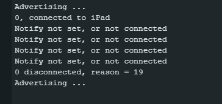

    

 

- nRF Connect for ios:
    - 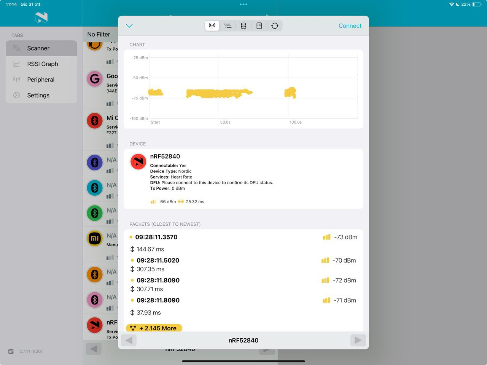

    - 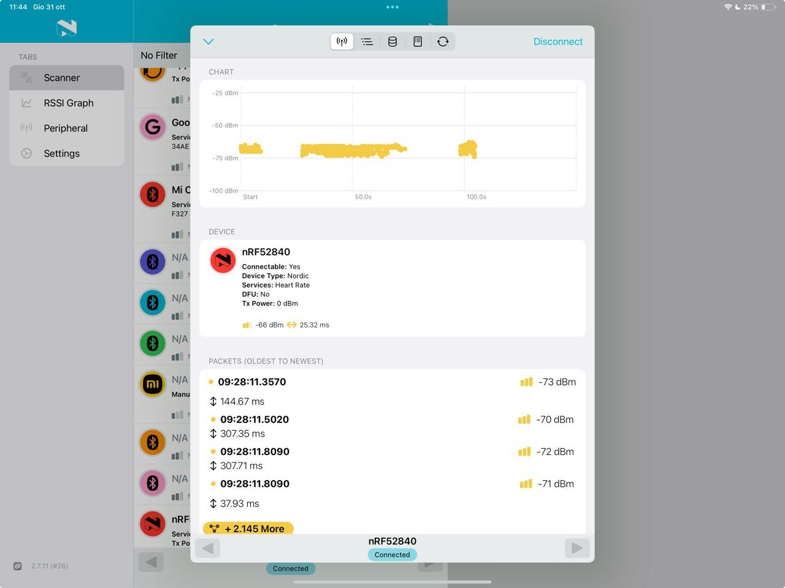

### b) HRM BLE central, 10'
* Build and run the previous nRF52840 BLE example.
* Use the .ino link on the page to get the example code.
* Open the Arduino serial monitor to enter a message.
* Use a second nRF52840* as a HRM peripheral. 
    -> how? unfortunatly i don't have a second nRF52840, so i can't test this part.

### Solution:
- [source code](BT_central/BT_central.ino)

- Arduino serial monitor:
    - 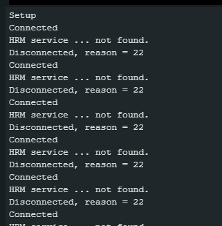

- nRF Connect for ios:
    - 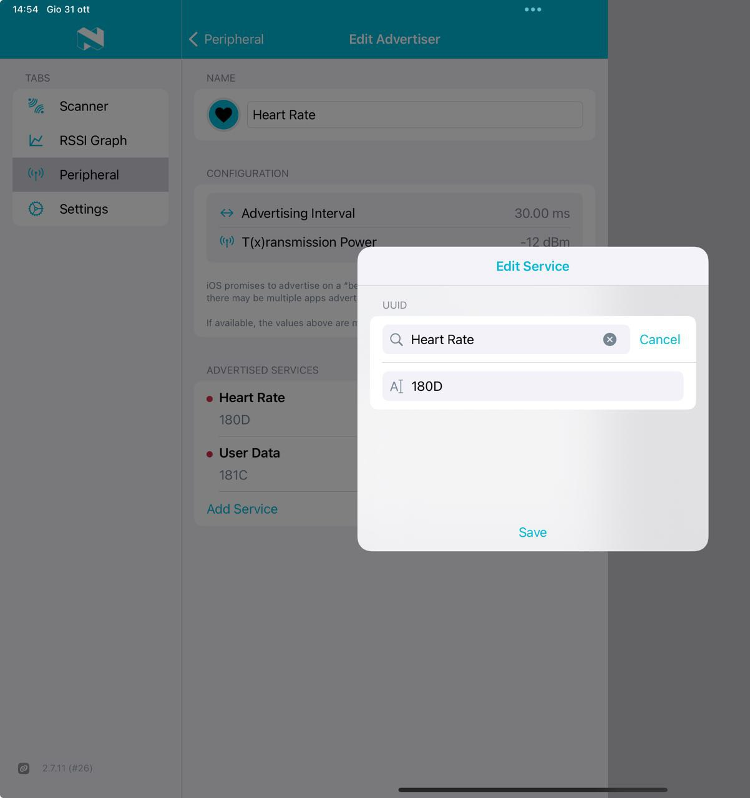

    - 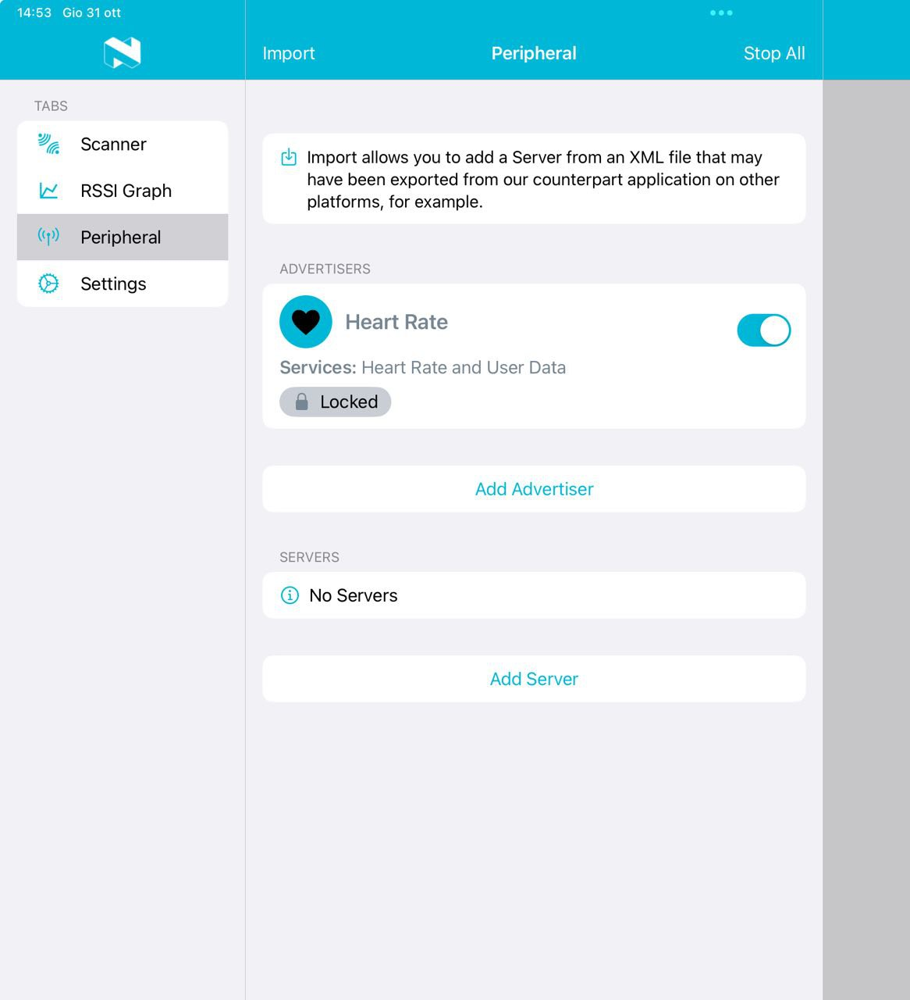

*Or your smartphone as a [peripheral simulator](https://play.google.com/store/search?q=BLE%20peripheral%20simulator&c=apps&hl=en_US&gl=US).

### c) UART BLE peripheral, 10'
* Build and run the previous nRF52840 BLE example.
* Use the .ino link on the page to get the example code.
* Write bytes to RX with a generic BLE explorer app.
* Check the serial monitor to see the received bytes*.

### Solution:

- [source code](BT_peripheral_UART/BT_peripheral_UART.ino)

- Arduino serial monitor:
    - 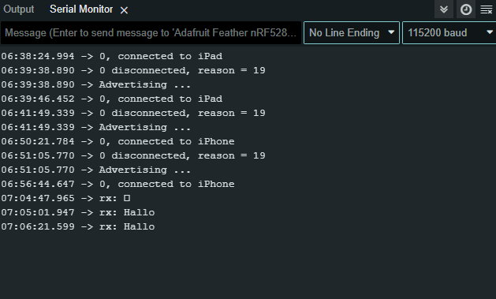

- nRF Connect for ios:
    - 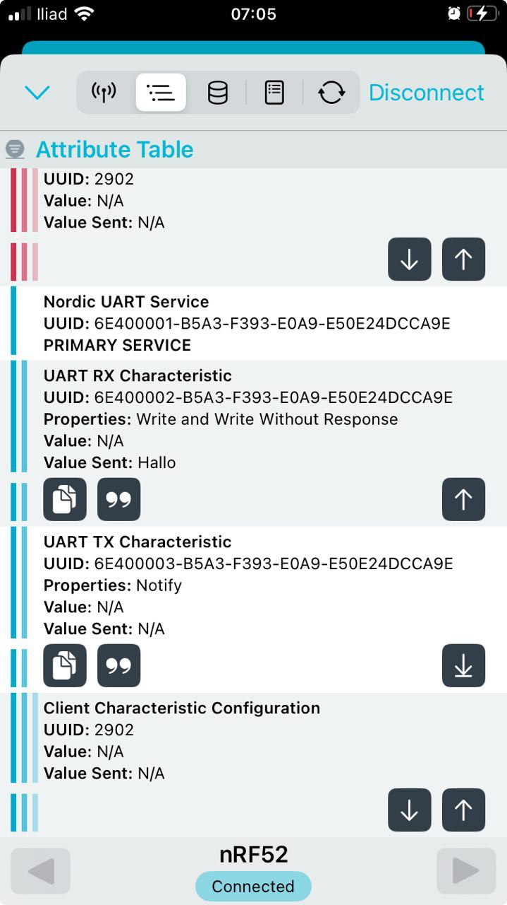
    - 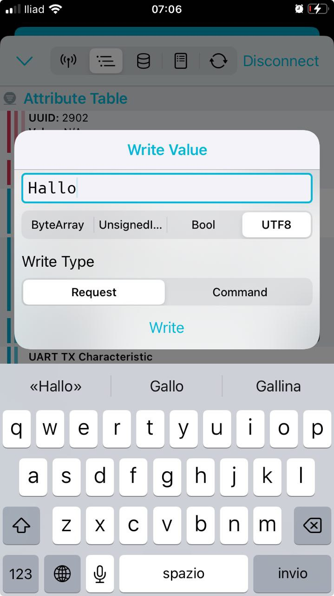

*Why do some bytes not show up?

### d) UART BLE central, 10'
* Build and run the previous nRF52840 BLE example.
* Use the .ino link on the page to get the example code.
* Open the Arduino serial monitor to enter a message.
* Use a second nRF52840 as a UART peripheral.

- Arduino serial monitor:
    - 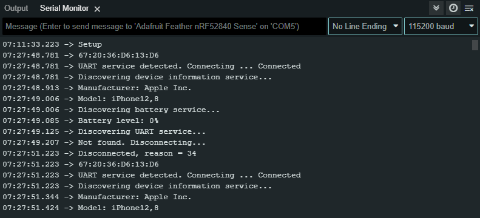

- nRF Connect for ios:
    - 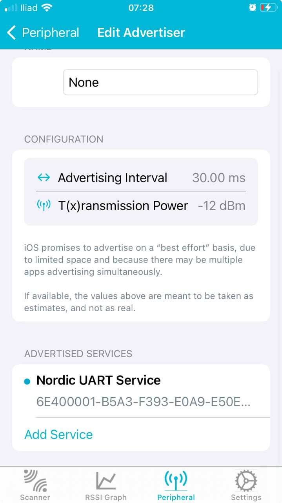
    - 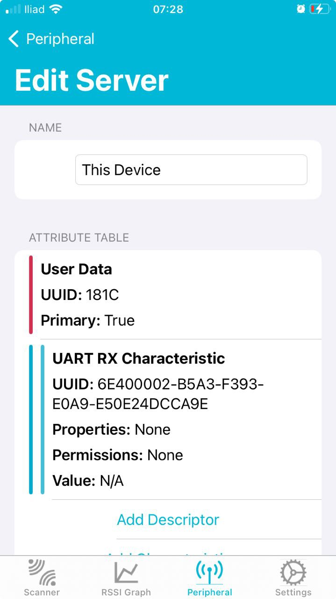

### e) Scanner BLE central, 10'
* Build and run the previous nRF52840 BLE examples.
* Use the .ino link on the page to get the example code.
* Test the scanner with a (simulated) HRM peripheral.
* Adapt the scanner to scan for the beacon observable.
* Bonus: Scan for Covid-19 apps as described [here](https://steigerlegal.ch/2020/07/06/swisscovid-app-bluetooth/).

### Solution:
- [code](UartBleScannerCentral/UartBleScannerCentral.ino)

- Arduino serial monitor:
    - 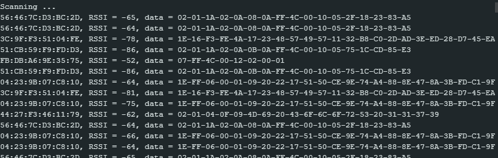