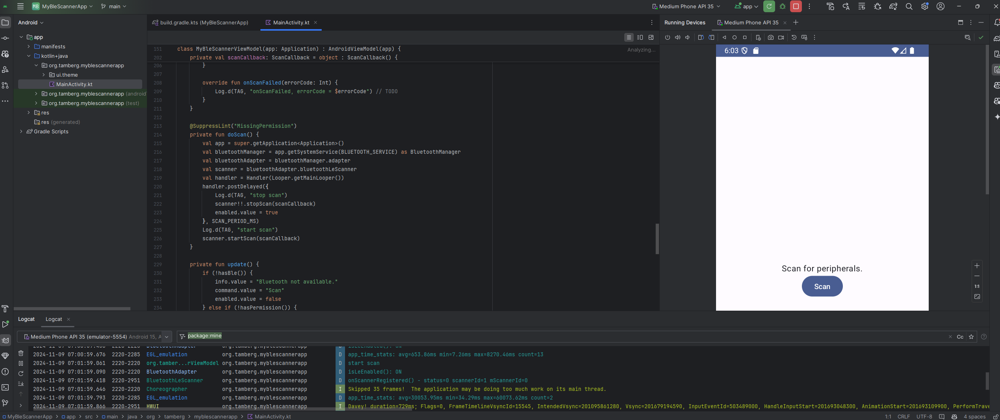
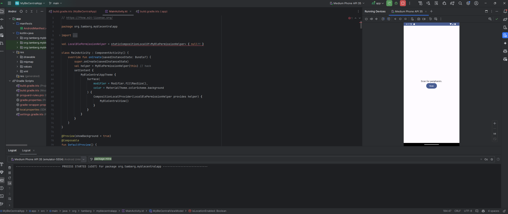
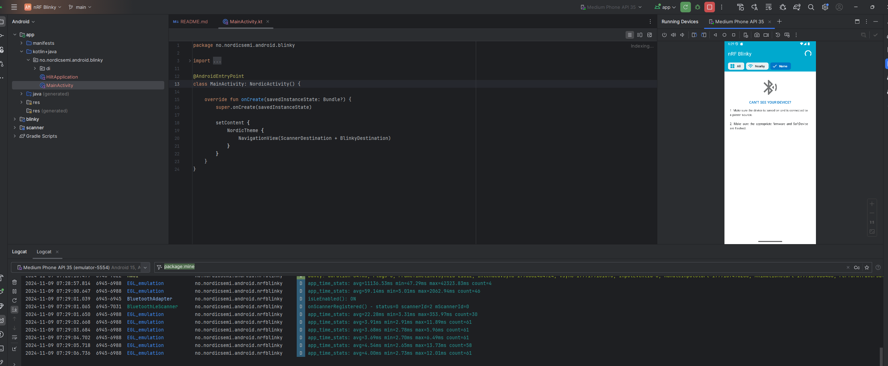
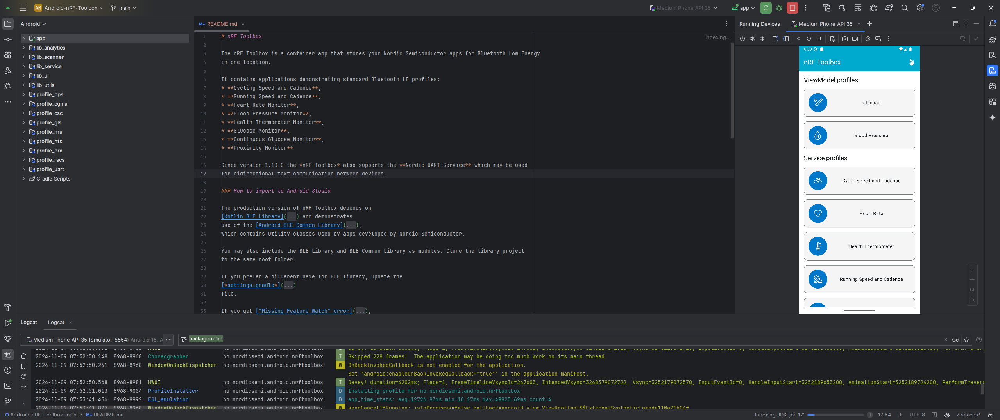
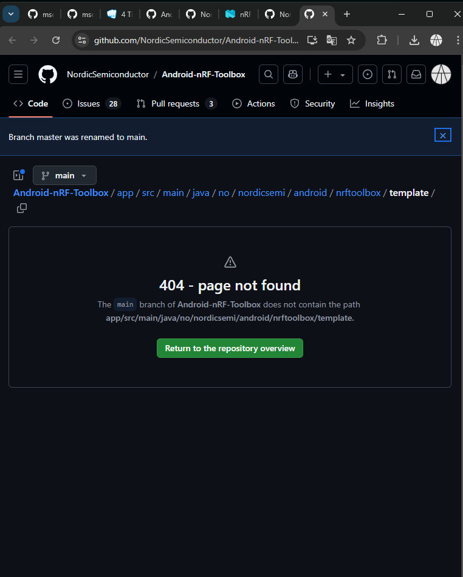
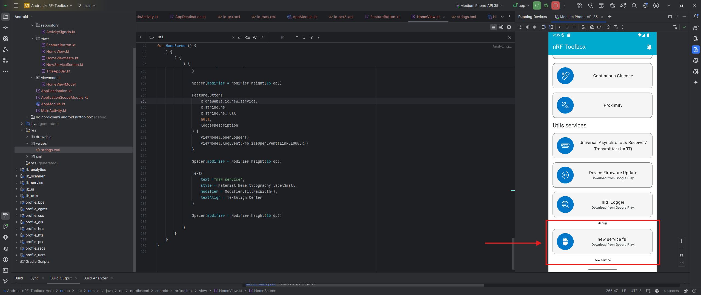

# MSE TSM MobCom
NOTE: i dont have the possibility to register the interation with phissical device so here i put the code and the result of the build and run of the app on emulator.

## Hands-on of lesson 7
For slides and example code, see [lesson 7](../../../mse-tsm-mobcom/blob/master/07/README.md)

> *Note: Do not work on this repository right away.* 
> *[Create your personal copy by clicking this GitHub Classroom link](https://classroom.github.com/a/daKqa8-Y).*

### a) Android BLE scanner, 10'
* Build and run the [MyBleScannerApp example code](https://github.com/tamberg/mse-tsm-mobcom/tree/master/07/Android/MyBleScannerApp).
* Check the Logcat output with filter "MainActivity".
* If it works, you should see BLE devices around you.
* Test the app by disabling Bluetooth, location, etc.
* Done? Add a button to the UI to start a scan. 

### Solution:
- here can see build with success and sone test with logcat: 

- here can see the code of the MainActivity.kt file: 
[file](MyBleScannerApp/app/src/main/java/org/tamberg/myblescannerapp/MainActivity.kt)

### b) Android BLE central, 10'
* Build and run the [MyBleCentralApp example code](https://github.com/tamberg/mse-tsm-mobcom/tree/master/07/Android/MyBleCentralApp).
* Use the nRF52840 with [HRM BLE peripheral code](https://github.com/tamberg/mse-tsm-mobcom/blob/master/06/Arduino/nRF52840Sense_HrmBlePeripheral/nRF52840Sense_HrmBlePeripheral.ino).
* Check the Logcat output with filter "MainActivity".
* If it works, you should see heart rate measurements.
* Done? Read the Android app source code in detail.

### Solution:
- here can seethe result:

- as expected  there is some error with the emulator bluetooth that need to be fixed, but the code is working fine.

- here can see the code of the MainActivity.kt file:
[file](MyBleCentralApp/app/src/main/java/org/tamberg/myblecentralapp/MainActivity.kt)
### c) Android BLE issues, 10'
* It looks easy, but BLE on Android has many issues.
* Read some of the tips how to [make it actually work](https://punchthrough.com/android-ble-development-tips/).
* Also check this [list of issues](https://github.com/iDevicesInc/SweetBlue/wiki/Android-BLE-Issues) to get an impression.
* iOS BLE seems more stable. Why could that be?
* Done? Find some stats about the Android OS.

### Solution:
 - reading done

### d) nRF Blinky app example, 10'
* [Android nRF Blinky](https://github.com/NordicSemiconductor/Android-nRF-Blinky) is a complete BLE app example.
* It shows how to use the [Nordic Android BLE library](https://github.com/NordicSemiconductor/Android-BLE-Library/).
* Read the library docs and study the app source code.
* Which parts become easier by using this library?
* Done? Sketch the BLE API of the peripheral. 

### Solution:
- i have downloade and added in this folder the code of the nRF Blinky app:
- relevant files: 
    - [AndroidManifest.xml](Android-nRF-Blinky-main/app/src/main/AndroidManifest.xml)
    - [build.gradle.kts](Android-nRF-Blinky-main/app/build.gradle.kts)
    - [MainActivity.kt](Android-nRF-Blinky-main/app/src/main/java/no/nordicsemi/android/blinky/MainActivity.kt)
    - [BlinkyManager.kt](Android-nRF-Blinky-main/app/src/main/java/no/nordicsemi/android/blinky/di/BlinkyModule.kt)

- app build and execution: 

    

### e) nRF Toolbox Plugin, 1h+
* The [nRF Toolbox app](https://www.nordicsemi.com/Software-and-Tools/Development-Tools/nRF-Toolbox) allows to write new plugins.
* Build and run the [nRF Toolbox app source code](https://github.com/NordicSemiconductor/Android-nRF-Toolbox).
* [Write a plugin](https://github.com/NordicSemiconductor/Android-nRF-Toolbox/tree/master/app/src/main/java/no/nordicsemi/android/nrftoolbox/template) for [a custom SHT30 BLE service](https://github.com/tamberg/mse-tsm-mobcom/blob/master/06/Arduino/nRF52840Sense_HygrometerBlePeripheral/nRF52840Sense_HygrometerBlePeripheral.ino#L17-L19).
* Test the app with [a nRF52840 BLE peripheral](https://github.com/tamberg/mse-tsm-mobcom/blob/master/06/Arduino/nRF52840Sense_HygrometerBlePeripheral/nRF52840Sense_HygrometerBlePeripheral.ino).
* Done? Create a custom icon for your service.

### Solution:
- i have downloade and added in this folder the code of the nRF Toolbox app: 
    [here ](Android-nRF-Toolbox-main)

- build and run prooof: 

    
- plugin: 

    the firs link provided: * [Write a plugin](https://github.com/NordicSemiconductor/Android-nRF-Toolbox/tree/master/app/src/main/java/no/nordicsemi/android/nrftoolbox/template) * is not working, here can see the result:

    

    - passage that i have done to create custom plugin: 

    - new implemented plugin:
      

    - you can find result code [here](Android-nRF-Toolbox-main)! 