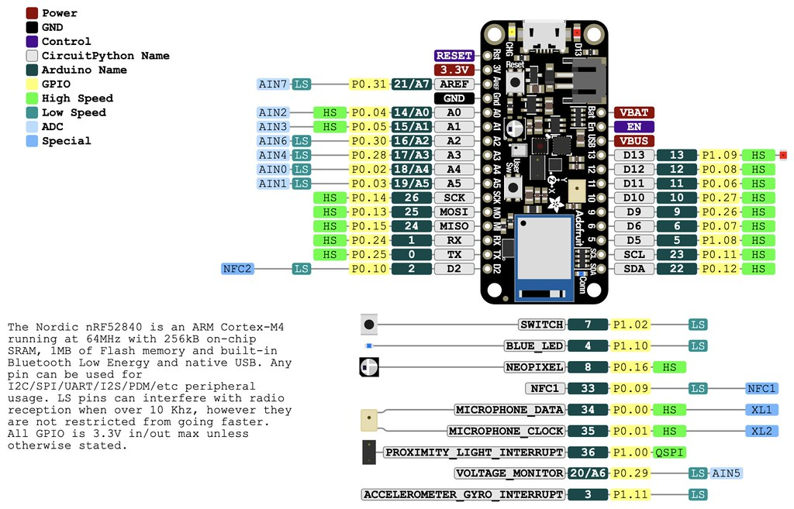

# TSM_MobComp_2024-2025

# Adafruit microcontroller

Setup:  Preferences > Additional Boards Manager 
*   URL: https://adafruit.github.io/arduino-board-index/package_adafruit_index.json
* Tools > Board > Boards Manager... > Adafruit nRF52 -> install

## Pinout

### Usefull link:

prof repo: [link](https://github.com/tamberg/mse-tsm-mobcom?tab=readme-ov-file)

Appunti: [link](https://web.goodnotes.com/s/mOGS2ArFT7wInovDZkuHcq#page-98)

teams: [link](https://teams.microsoft.com/v2/?tenantId=9d1a5fc8-321e-4101-ae63-530730711ac2)
