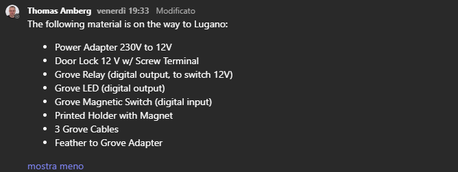
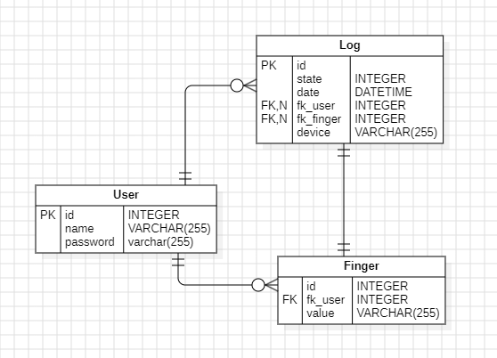
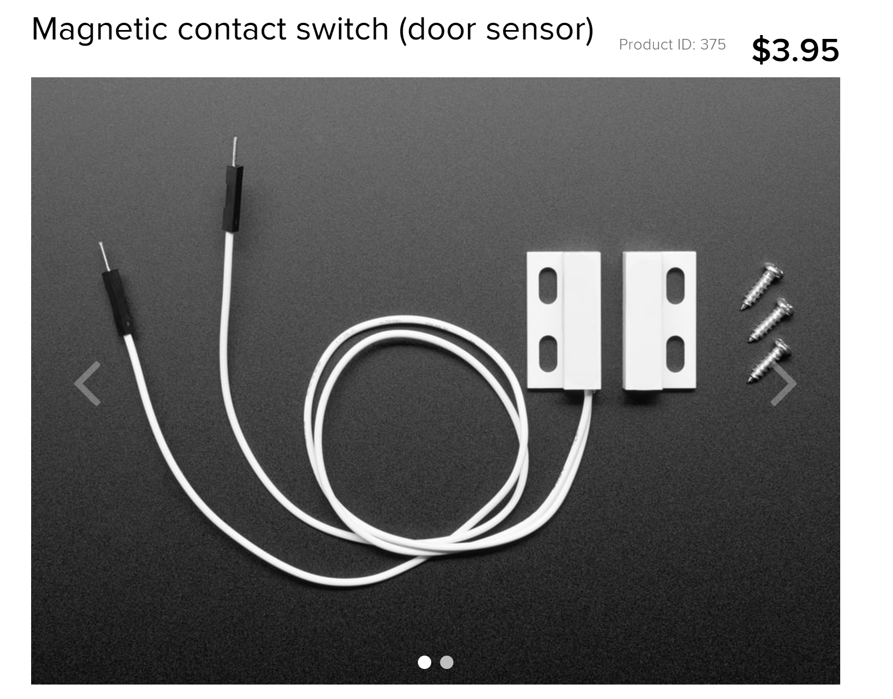
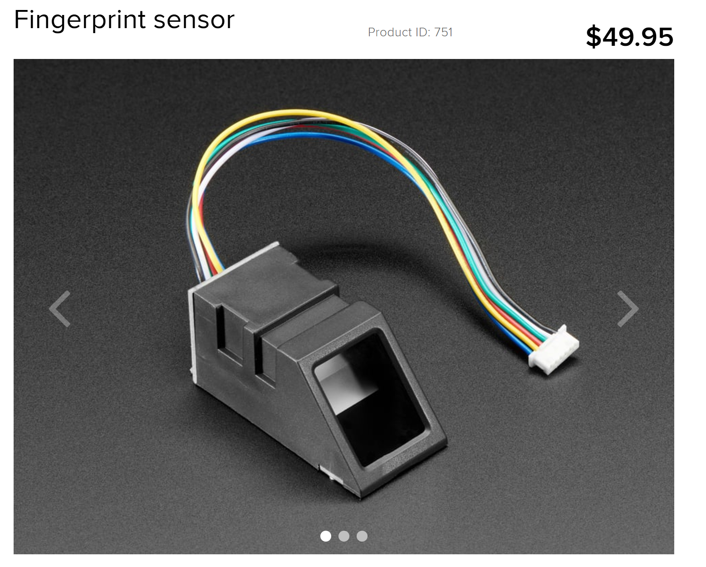
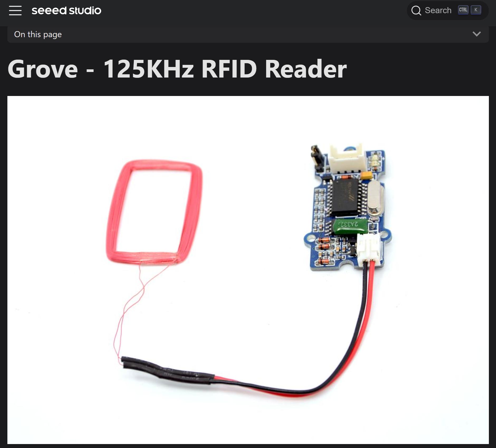
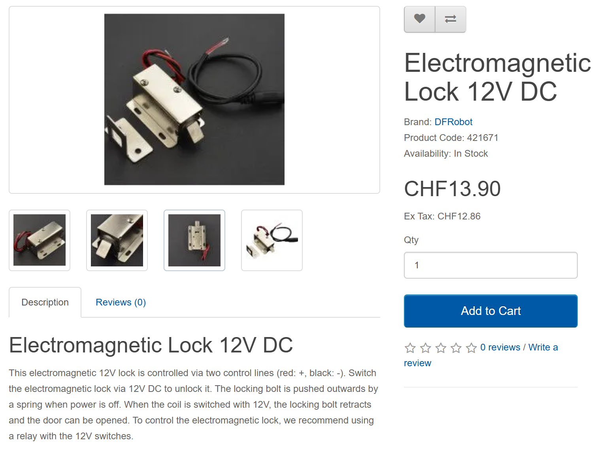
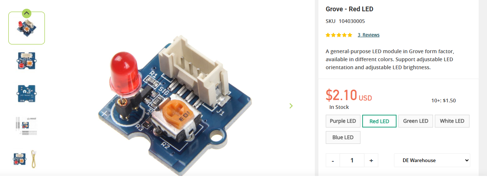

# Project name: SmartLock

## Material provided

# Project description: 
Enhance your home security with a Bluetooth-enabled smart door system that combines convenience and reliability.


## Connection


## UML DIAGRAM



### Hardware: 
An Adafruit microcontroller with a sensor to monitor door status and a Bluetooth module for wireless communication.

#### Sensors:
Door sensor: 


Detects if the door is open or closed.
[Link:](https://www.adafruit.com/product/375)
<br>
<br>

Code: 
```cpp
const int sensorPin = 13;  // Pin digitale collegato al sensore
const int ledPin = 10;    // LED di stato per verificare forse non lo metto perche gia usato per debuggare bt.

void setup() {
    pinMode(sensorPin, INPUT_PULLUP);  // Attiva la resistenza pull-up interna cosi non devo tirare su il pin ogni volta che viene tirato a gnd
    pinMode(ledPin, OUTPUT);
    Serial.begin(9600);
}

void loop() {
    int sensorState = digitalRead(sensorPin);
    if (sensorState == LOW) {
        // Porta chiusa
        digitalWrite(ledPin, HIGH);
        Serial.println("Porta chiusa");
    } else {
        // Porta aperta
        digitalWrite(ledPin, LOW);
        Serial.println("Porta aperta");
    }
    delay(100);  // Intervallo di lettura
}
```



TODO: 
<br>
Provide here the docs to use the sensor and where is implemented in project

---

<br>
<br>

Fingerprint sensor: 

Detects authorized users and unlocks the door.
[Link:](https://www.adafruit.com/product/751)



TODO:
Provide here the docs to use the sensor and where is implemented in project

---

optional alternatives to fingerprint: RFID sensor: 
[link:](https://wiki.seeedstudio.com/Grove-125KHz_RFID_Reader/)



#### Actuators:

Electric lock:
lock that need to be installed on the frame of the door to oerate the lock and unlock mechanism. [Link:](https://www.bastelgarage.ch/electromagnetic-lock-12v-dc?search=lock)



Since this accessories require 12V to operate, we need to use a relay to control the lock: 
[Link:](https://www.seeedstudio.com/Grove-Relay.html)

and an external power supply to power the lock: [Link](https://www.bastelgarage.ch/12v-dc-4000ma-power-supply-ac-dc-adapter-5-5mm-2-1mm-plug?search=12v)

<br>
TODO:
Provide here the docs to use the sensor and where is implemented in project

<br>
<br>


Led: 
a led thad show us if microcontroller is in the state of Fingerprint read to unlock or registration state.
if on is on registration

[Link:](https://www.seeedstudio.com/Grove-Red-LED-p-1142.html)



[TODO] put Diagram of state machine and documentation of how use this component.
<br>
<br>
---
### Connetions:


Todo: provide here an image of phisical connection to the microcontroller


---

<br>

### Software: 
An Android app allows users to control the door, check its status in real time, and receive notifications.
Backend: A secure backend logs all access events, enabling users to review the door’s activity history anytime.


## Usefull command: 

docker compose -p tsm_mobcomp_project_backend up -d --build